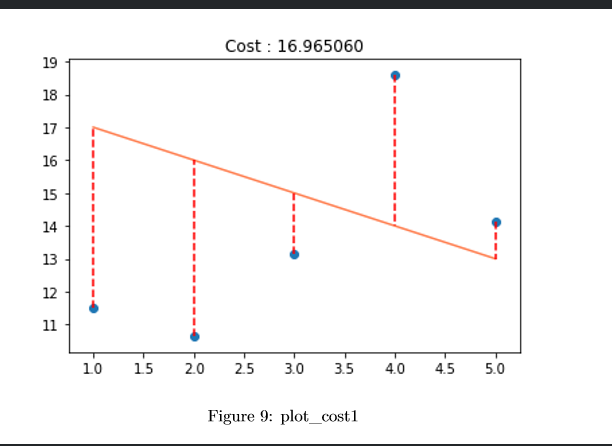

## ex08

질문 시간이다.

**1 - What is a hypothesis and what is its goal?**
(It’s a second chance for you to say something intelligible, no need to thank us!)

- 말 그대로 가설이다. 독립된 x값와 종속된 y값이 주어진 파라미터(theta0, theta1) 등에 어떻게 변화 할지를 예측하여 수식화한다. goal은 실제 결과값과 같게 모델을 만드는 것이다.

**2 - What is the cost function and what does it represent?**

- 평가함수이다. 내가 만든 모델과 실제 결과값의 차이를 반환 해주는 함수이다. 여기서 이 cost를 계산하는 방식은 여러가지가 있는데 경우에 따라 다르지만 MSE(표준 제곱 오차)를 많이 사용한다.

**3- What is Linear Gradient Descent and what does it do?**
(hint: you have to talk about J, its gradient and the theta parameters...)

- cost함수의 gradient를 계산하면 cost를 가장 작게 만드는 theta parameters를 알 수 있다.

  이로써 예측 모델의 parameters를 계산할 수 있다.

**4 - What happens if you choose a learning rate that is too large?**

- 함수가 발산하여 nan이 출력된다. 또한, 올바른 theta parameters를 jump해버린다.

**5 - What happens if you choose a very small learning rate, but still a sufficient number of cycles?**

- 초기에 실제 모델과 꽤 유사하게 결과를 만드는(cost function이 최소에 가까운) theta parameters를 넣었다면 문제가 안되지만 반대의 경우 cost를 가장 작게 만드는 theta parameters에 다가갈수 없다. 이때는 cycles를 늘려주어야 한다.

**6 - Can you explain MSE and what it measures**

- 오차의 제곱에 평균을 취한것이다.

여기서 보이는 빨간 점선들의 거리의 평균을 취한것이다.