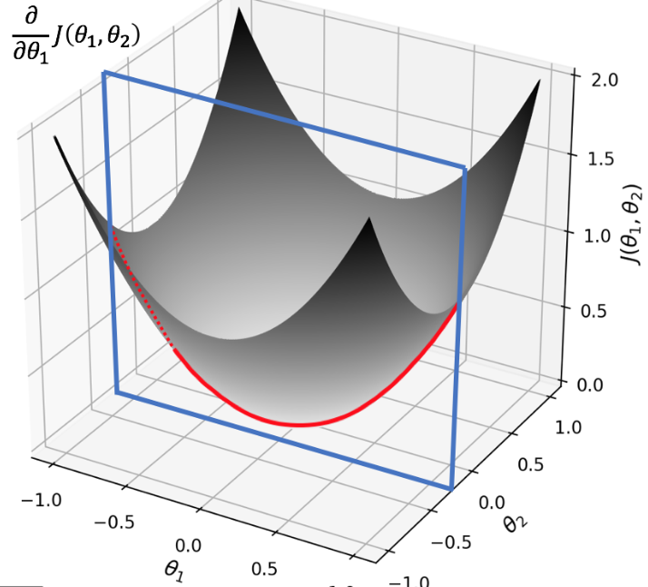

**1 -What is the main difference between univariate and multivariate linear regression, in terms of variables?**

- 예를 들어 날씨를 판단할때 온도variable 하나로 날씨를 예측하는것보다 온도, 습도, 기압등 여러가지 요인을 기준으로 예측하는게 더정확하다. univariate는 온도하나로 날씨를 예측하는 것이고 multivariate는 온도뿐아니라, 습도, 기압, 조도등 여러 요소의 영향력을 더 추가하는것이다.
  이로써 multivariate는 상대적으로 더 정확한 예측이 가능하지만, 변수의 개수 만큼 학습 시간이 늘어난다.

**2 - Is there a minimum number of variables needed to perform a multivariate linear regression? If yes, which one?**

- 변수는 최소 2개여야 multivariate linear regression이라 부를 수 있다.

**3 - Is there a maximum number of variables needed to perform a multivariate linear regression? If yes, which one?**

- 변수의 최대 수는 제한이 없다. 하지만 모든 변수를 학습시키기엔 시간이 많이 걸리므로 유의미한 상관관계를 가지는 변수를 선택할 필요가 있다.

**4 - Is there a difference between univariate and multivariate linear regression in terms of performance evaluation?**

- 적어도 위에서 실행한것에 따르면 엄청난 차이가 있다. multivariate는 훨씬 더 정확하다.

**5 - What does it mean geometrically to perform a multivariate gradient descent with two variables?**

- univariate 에선 cost함수의 최솟값을 찾기위해 cost함수를 미분하여 기울기가 0을 만족하는 thetas를 찾아가는 과정이었다.(포물선에서 극솟값)
  이를  2가지 변수로 확장시키면(3차원 포물선 에서의 극솟값일 것이다.)

  

기하학적으로 해석한 예이다